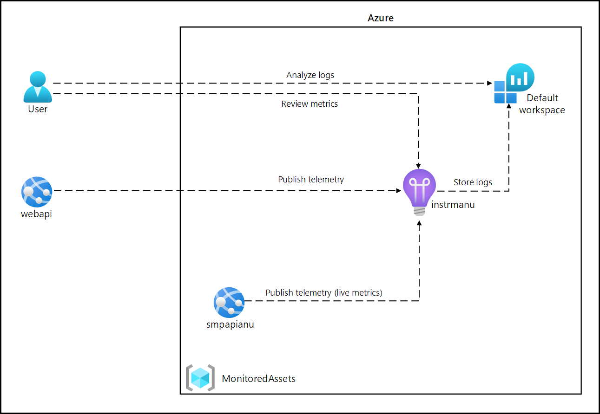

# Lab Scenario Preview - 11 - Monitor services that are deployed to Azure

## Lab overview
In this lab, you will create an Application Insights resource in Azure that will be used to monitor and log application insight data for later review. The API will be set to automatically scale if demand increases to a certain threshold and logging the data will help determine how the service is being utilized.

## Objective
+ Exercise 1: Create and configure Azure resources
    + Task 1: Open the Azure portal
    + Task 2: Create Log Analytics Workspace
    + Task 3: Create an Application Insights resource
    + Task 4: Create an Azure Web API resource
    + Task 5: Configure web API autoscale options
+ Exercise 2: Monitor a local web API by using Application Insights
    + Task 1: Build a .NET Web API project
    + Task 2: Update app code to disable HTTPS and use Application Insights
    + Task 3: Test an API application locally
    + Task 4: Review metrics in Application Insights
+ Exercise 3: Monitor a web API using Application Insights
    + Task 1: Deploy an application to the web API
    + Task 2: Configure in-depth metric collection for Web Apps
    + Task 3: Get updated metrics in Application Insights
    + Task 4: View real-time metrics in Application Insights
+ Exercise 4: Application Insights logging with .NET
    + Task 1: Configure logging for a .NET API app
    + Task 2: Test logging of a .NET Core API app
    + Task 3: Review the Application Insights logging

## Architecture diagram

Once you understand the lab's content, you can start the Hands-on Lab by clicking the **Launch** button located in the top right corner. This will lead you to the lab environment and guide. You can also preview the full lab guide [here](https://experience.cloudlabs.ai/#/labguidepreview/26f3f953-1130-45e6-9acf-ac7e2f4bff46) if you want to go through detailed guide prior to launching lab environment.
